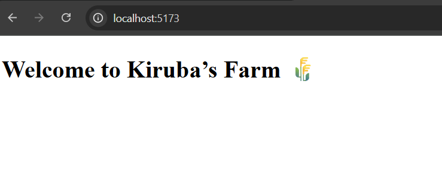

# App component Setup:
  # 🌾 Kiruba's Farm React App

### 👩‍💻 Code Example (App.jsx)
```jsx
import React from 'react'

const App = () => {
  return (
    <div>
      <h1>Welcome to Kiruba's Farm 🌾</h1>
    </div>
  )
}

export default App
```
---

### 🖼️ Example Output
 